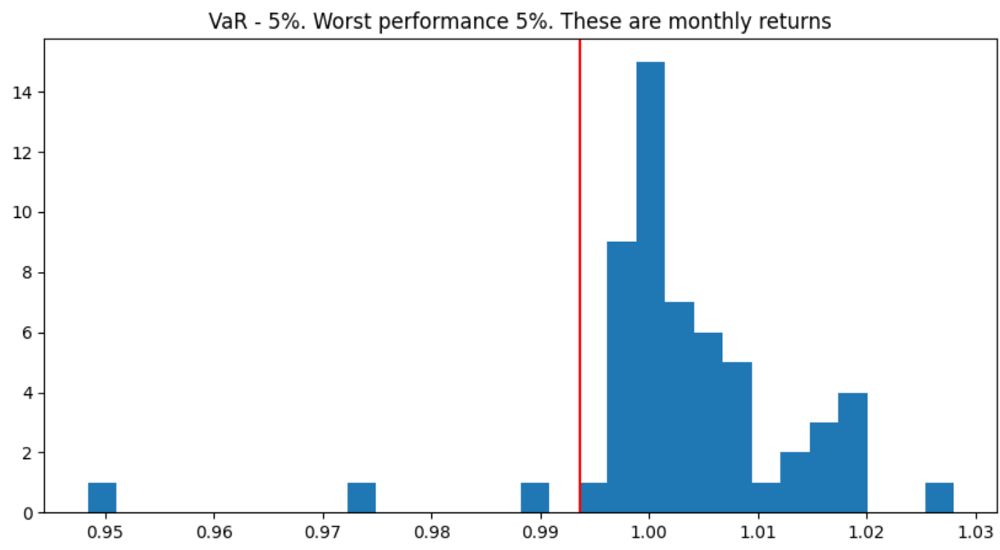
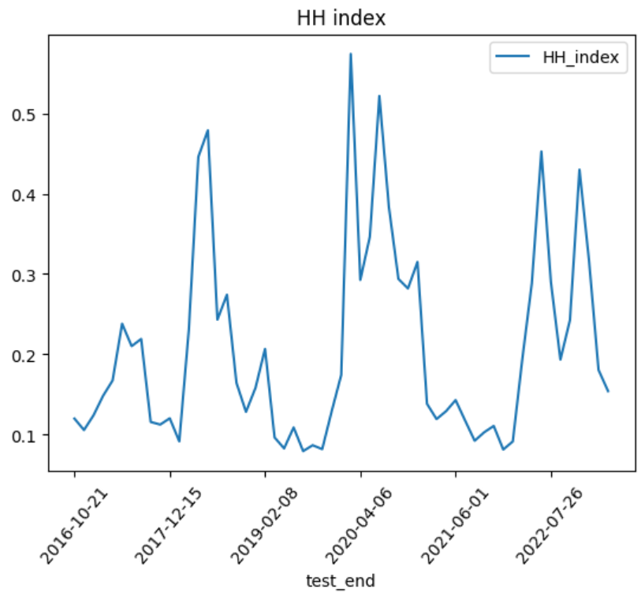

<h4>School of Quants. Python project 2</h4>

Simple bond strategy, optimization of portfolio returns over the window. We want to buy bonds at a discount when Indicative, Price % is low and sell them when they are trading at a premium. Therefore, I ran return to variance maximization over a window of 180 days with step of 30 days, these 30 days were used to backtest the performance of composed portfolio.

The notebook has formulas whilst the optimization itself is in optimize_portfolios.py file. I decided to split them because running multiprocessing with tqdm in notebook is a mess.

The results are below depicted in the graphs:

